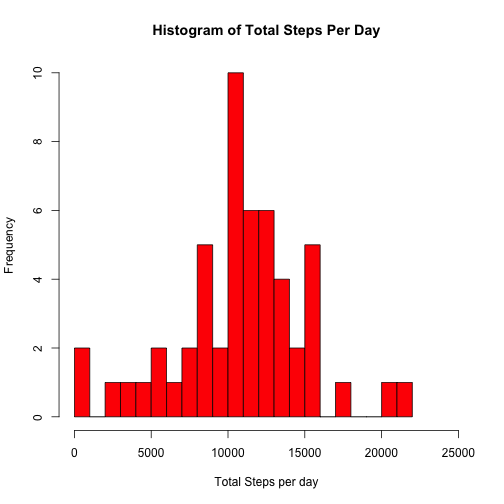
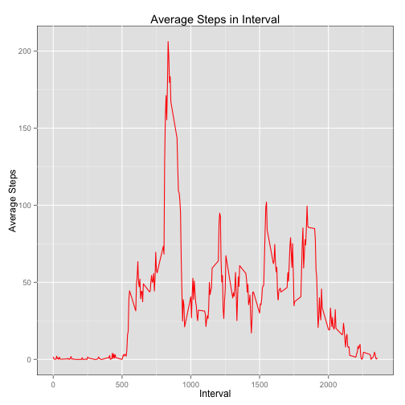
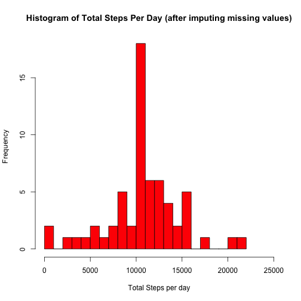
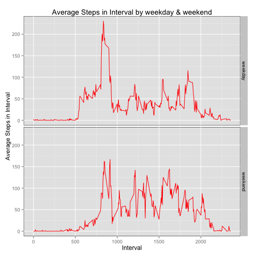

# Reproducible Research: Peer Assessment 1
Author: Nitin Gupta  
  
  
## Loading and preprocessing the data
Create a dataframe from activity data having 3 columns.  
Create a column 'datetime' by appending 5 minute intervals in HHMM form with correspoding dates.

```r
dfActivity <- read.csv("activity.csv")
dfActivity$datetime <- strptime(paste(dfActivity$date, 
                                      sapply(dfActivity$interval, formatC, width=4, flag=0)),
                                format="%Y-%m-%d %H%M")
dfActivity$time <- format(dfActivity$datetime, format="%H:%M")
```


## What is mean total number of steps taken per day?
Load the plyr package and aggregate total number of steps by date.  
Make a histogram of total steps per day and output their mean and median.

```r
library(plyr)
dfActivity.d <- ddply(dfActivity, c("date"), summarise, totalStepsPerDay=sum(steps)) 
with(dfActivity.d, 
     {hist(totalStepsPerDay, col="red", breaks=20, xlim=c(0,25000), 
           xlab="Total Steps per day", main="Histogram of Total Steps Per Day")})
```

 

```r
mean(dfActivity.d$totalStepsPerDay, na.rm=T)
```

```
## [1] 10766
```

```r
median(dfActivity.d$totalStepsPerDay, na.rm=T)
```

```
## [1] 10765
```


## What is the average daily activity pattern?
Aggregate average number of steps by each 5 minute interval and make a plot.

```r
library(plyr)
dfActivity.i <- ddply(dfActivity, c("interval"), summarise, avgStepsInInterval=mean(steps, na.rm=T))
library(ggplot2)
ggplot(dfActivity.i, aes(x=interval, y=avgStepsInInterval)) + 
        geom_line(colour="red") + 
        theme(panel.background=element_rect(color="black")) +
        xlab("Interval") + ylab("Average Steps") +
        ggtitle("Average Steps in Interval")
```

 

Output the interval that has the maximum number of steps on average.

```r
with(dfActivity.i, {interval[which(avgStepsInInterval==max(avgStepsInInterval))]})
```

```
## [1] 835
```


## Imputing missing values
Total number of missing values in original dataset.

```r
sum(is.na(dfActivity$steps))
```

```
## [1] 2304
```
Construct a new data frame by filling missing steps values using the average number of steps in that interval.  
Create a new column avgStepsInInterval aggregated with mean steps values by interval.  
One way to fill NA steps values is to use avgStepsInInterval subsetted by a logical vector of NA steps values.

```r
dfActivityNew <- dfActivity
dfActivityNew$avgStepsInInterval = ave(dfActivityNew$steps, dfActivityNew$interval, 
                                        FUN = function(x) mean(x, na.rm=T))
vMissingSteps <- is.na(dfActivityNew$steps)
dfActivityNew$steps[vMissingSteps] = dfActivityNew$avgStepsInInterval[vMissingSteps]
```
Aggregate total steps per day and make a histogram.  
Compare their mean and median to that of original dataset.

```r
library(plyr)
dfActivityNew.d <- ddply(dfActivityNew, c("date"), summarise, totalStepsPerDay=sum(steps)) 
with(dfActivityNew.d, 
     {hist(totalStepsPerDay, col="red", breaks=20, xlim=c(0,25000), xlab="Total Steps per day",
           main="Histogram of Total Steps Per Day (after imputing missing values)")})
```

 

```r
mean(dfActivityNew.d$totalStepsPerDay)
```

```
## [1] 10766
```

```r
median(dfActivityNew.d$totalStepsPerDay)
```

```
## [1] 10766
```
After imputing missing steps values from average steps per interval:
* The frequency of the interval 10000-11000 steps increases.
* The mean and median of total steps per day have the same value 10766. Prior to filling missing data, the median was 10765 and the mean was 10766 steps.  


## Are there differences in activity patterns between weekdays and weekends?
Using the dataset with imputed missing values, first create a factor variable with 2 levels - "weekend" and "weekday" depending upon the day of week.

```r
dfActivityNew$wdfactor <- ifelse(weekdays(dfActivityNew$datetime) %in% c("Saturday","Sunday"),
                                 "weekend", "weekday")
dfActivityNew <- transform(dfActivityNew, time=as.factor(time), wdfactor=as.factor(wdfactor))
```
Create a panel plot of average steps taken by each 5 minute interval, averaged across all weekdays and weekends.

```r
library(plyr)
dfActivityNew.i <- ddply(dfActivityNew, c("wdfactor", "interval"), 
                         summarise, avgStepsInInterval=mean(steps))
library(ggplot2)
ggplot(dfActivityNew.i, aes(x=interval, y=avgStepsInInterval)) + 
        geom_line(colour="red") + 
        facet_grid(wdfactor ~ .) + 
        theme(panel.background=element_rect(color="black")) + 
        xlab("Interval") + 
        ylab("Average Steps in Interval") + 
        ggtitle("Average Steps in Interval by weekday & weekend")
```

 
